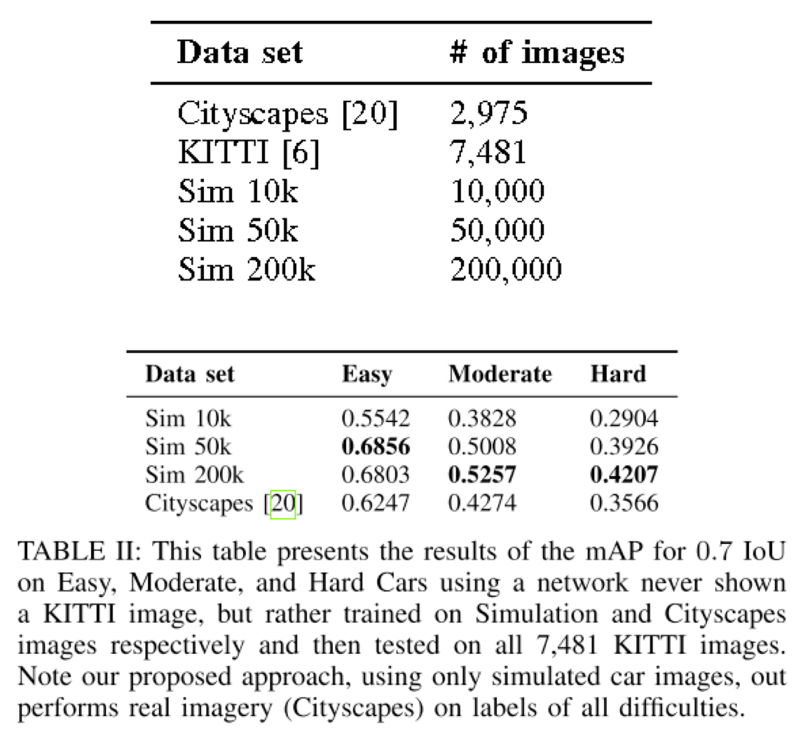
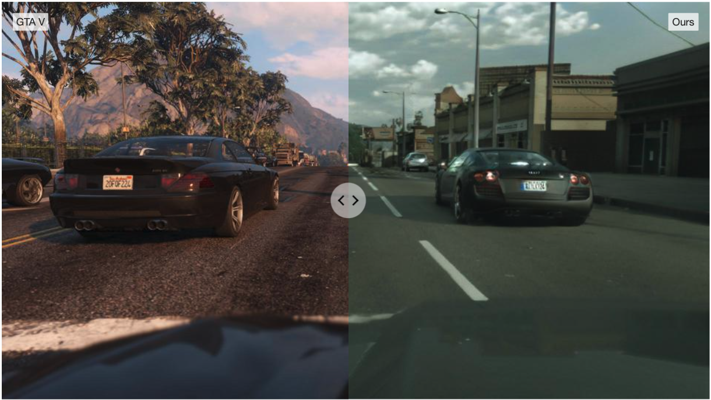

---

marp: true
inlineSVG: true
theme: blue
draft: true

---
<!-- _color: white -->

# Why Does Synthetic Data Matter? 

### Generation of synthetic data for machine learning

 

### Hallison Paz

---
<!-- _class: invert -->

---
<!-- _footer: [visgraf.github.io/syntheticlearning/](https://visgraf.github.io/syntheticlearning/) -->

# Generation of synthetic data for machine learning

### 1. Why does synthetic data matter?
### 2. How to generate synthetic data and train a model with it
### 3. Do they live in a simulation? Training models for dynamic environments

---
<!-- _class: topic -->

# Context

---
<!-- paginate: true -->
# Context

#### Machine learning has improved performance on a lot of computer vision tasks

<!-- Computer vision -->

##### Examples:
– Object Detection
– Classification
– Instance segmentation

---
# Context

#### Machine learning also enabled new applications

- Style transfer
- Deep Fakes
- Autonomous vehicles

---

# Context

### The last few years: AI Graphics

– Scene semantic segmentation
– View Synthesis
– Object reconstruction
– Materials etc

---
# Requirements

### – Computational power / storage

### – Methods

### – Data a lot of data 

---
<!-- _class: topic --->

# THERE'S NOT ENOUGHT DATA

---
# We need labeled data

### Most of these applications are trained using supervised learning

$$ f(x) = y $$

<!-- _footer: More at: [youtu.be/TJkyhV_Mfcw](https://youtu.be/TJkyhV_Mfcw) -->
---

# HOW DO WE LABEL DATA?

---

# How do we label data?

**Annotation Process: humans label data**

* Expensive: cost money and time
* Error prone: 
  * repetitive task 
  * sometimes it can be very hard

---
# How do we label data?

**Annotation Process: humans label data**

* Expensive: cost money and time
* Error prone: 
  * repetitive task 
  * sometimes it can be very hard
* You must validate

---
# BIAS

<!-- Give some dimension on the amount of data used to train something -->
### – We need a lot of data 
### – We also need to have a good **balance** between

<!-- _footer: What a [machine learning tool that turns Obama white](https://www.theverge.com/21298762/face-depixelizer-ai-machine-learning-tool-pulse-stylegan-obama-bias) can (and can’t) tell us about AI bias -->

---

# BIAS

* Simulate less frequent cases:
  *  Weather, 
  *  Illumination
  *  Shape
  *  Pose
  *  etc

---

# Copyright

---

# Privacy

* Data might be related to people
* Might have enormous consequences
* Regulations

---

# Creating large scale databases is hard

## Technical
* Need to annotate data
* Must have sufficent examples for each class
* Must guarantee class balance
  
## Ethical
* Copyright issues
* Privacy concerns

---
<!-- _class: topic -->

# Synthetic Data Matters!

---
# Before we dive in...

##### Some approaches to the data problem
### – Unsupervised / Self-supervised$^1$ learning
### – Data augmentation
### – Synthetic datasets

<!-- _footer: $^1$ You may be interested in check Yan Lecunn's presentation on Nvidia GTC-21-->
---

# Data augmentation

## Real data transformations that don't change the target label
* Flip, rotate, resize, scale...

## There are studies on generative methods for data augmentation $^2$
* Could it make the data distribution larger?

<!-- _footer: Refer to sections 5.3 and 5.4 of the survey Nikolenko, Sergey; [Synthetic Data for Deep learning](https://arxiv.org/abs/1909.11512); 2019. -->

---
<!-- _class: topic -->
<!-- _paginate: false -->

# Synthetic datasets

---

# Synthetic data advantages

* Automatic annotation
* Control over the amount of examples and class balancing
* Don't need to be related to real people (privacy)
* Copyright

* **Data democratization**

---

# AI Graphics

* Bridge between computer vision and computer graphics

* Shapenet: synthetic but build with human annotations

--- 

# Beforehand Questions

* How much **realism** do we need?
* Do we still **need real data**?
* How much effort to make it **work well** on real scenarios?
* How about the **effort** to generate synthetic data?
* **Who** is using it?
  
---
# BMW Factory Digital Twin
### Who is using it?

<iframe width="560" height="315" src="https://www.youtube.com/embed/6-DaWgg4zF8" title="YouTube video player" frameborder="0" allow="accelerometer; autoplay; clipboard-write; encrypted-media; gyroscope; picture-in-picture" allowfullscreen></iframe>

---
<!-- _class: topic -->
<!-- _paginate: false -->

# The Reality Gap

---

# The Reality Gap

* Discrepancy between reality and synthetic data
* It's hard to reproduce the richness of the real world
* Subtle details as real data noise can also be a barrier

### How much does it impact computer vision tasks?

---
##### Driving in the matrix: Can virtual worlds replace human-generated annotations for real world tasks?

---
<!-- _footer: M. Johnson-Roberson, C. Barto, R. Mehta, S. N. Sridhar, K. Rosaen, and R. Vasudevan. Driving in the matrix: Can virtual worlds replace human-generated annotations for real world tasks? In ICRA, 2017-->
# How much realism do we need?

* Gathered *high realism* data from GTA V
* Trained a Faster-RCNN model for **object detection** on 10K, 20K and 50K synthetic images.
* Evaluated performance on KITTI against a model trained on Cityscape.
* Achieved high levels of performance on real-world data **training only with synthetic** examples

---
# Photorrealistic data

* Number of synthetic images is significantly higher
* Lighting, color and texture variantion in the real world seems greater 
* Performance increased by a significant jump from 10K to 50K examples

<!-- _footer: M. Johnson-Roberson, C. Barto, R. Mehta, S. N. Sridhar, K. Rosaen, and R. Vasudevan. Driving in the matrix: Can virtual worlds replace human-generated annotations for real world tasks? In ICRA, 2017-->

---
# How much realism do we need?

*"Unlike these approaches, ours allows the use of low-quality renderers optimized for speed and not carefully matched to real-world textures, lighting, and scene configurations."*

<!-- _footer: Tobin J, Fong R, Ray A, Schneider J, Zaremba W, Abbeel P (2017) Domain randomization for transferring deep neural networks from simulation to the real world.2017 IEEE/RSJ Interna-tional Conference on Intelligent Robots and Systems (IROS):23–30-->

---
<!-- _class: topic -->

# Domain Randomization

---
# Domain Randomization

#### Idea
Provide a wide simulated variability to synthetic data distribution so that the model is able to generalize to real world data.

– Try to make reality a subset of the model "knowledge"

---

# Scene level Domain Randomization

* Number of objects
* Relative and absolute positions
* Number and shape of distractor objects
* Contents of the scene background
* Textures of all objects participating in the scene
* So on... 

---
# Distractors

* **Contextutal distractors**: objetcs similar to possible real scene elements, positioned randomly but coherently

* **Flying distractors**: geometric shapes with random texture, size, and position

---
# Rendering Level Domain Randomization

* Lighting condition
* Rendering quality
* Rendering type (ray tracing, rasterization ...)
* Noise
* So on...

<!-- _footer: Tobin J, Fong R, Ray A, Schneider J, Zaremba W, Abbeel P (2017) Domain randomization for transferring deep neural networks from simulation to the real world.2017 IEEE/RSJ Interna-tional Conference on Intelligent Robots and Systems (IROS):23–30-->
---

# Training an object detection for grasping

* Applied domain randomization with distractors (different objects at test time)
* Detector trained with no prior information about the color of the target object
* Model high enough accuracy in the real world to perform grasping in clutter.
* Used a modified version of VGG16

<!-- _footer: Tobin J, Fong R, Ray A, Schneider J, Zaremba W, Abbeel P (2017) Domain randomization for transferring deep neural networks from simulation to the real world.2017 IEEE/RSJ Interna-tional Conference on Intelligent Robots and Systems (IROS):23–30-->

---

# Training an object detection for grasping

<!-- _footer: Tobin J, Fong R, Ray A, Schneider J, Zaremba W, Abbeel P (2017) Domain randomization for transferring deep neural networks from simulation to the real world.2017 IEEE/RSJ Interna-tional Conference on Intelligent Robots and Systems (IROS):23–30-->

---

# Training deep networks with synthetic data: Bridging the reality gap by domain randomization

---

# Tremblay et al, 2018 

* Number and types of objects
  * 36 downloaded 3D models of generic sedan and hatch-back cars
* Number, types, colors, and scales of distractors, selected from a set of 3D models
* Texture and background photograph, both **taken from the Flickr 8K dataset**
* location of the virtual camera with respect to the scene
* Angle of the camera with respect to the scene
* Number and locations of lights (from 1 to 12)
* Visibility of the ground plane.

<!-- _footer: J. Tremblay, A. Prakash, D. Acuna, M. Brophy, V. Jampani, C. Anil, T. To, E. Cameracci, S. Boochoon, and S. Birchfield. Training deep networks with synthetic data: Bridging the reality gap by domain randomization. In Workshop on Autonomous Driving, CVPR-Workshops, 2018. -->

---
<!-- _class: topic -->
<!-- _paginate: false -->
# Fine Tuning

---

# Tremblay et al, 2018

* Object detection on cars + Domain randomization
* Dataset cheaper to produce
* Improved performance with fine-tuning on real images

<!-- _footer: J. Tremblay, A. Prakash, D. Acuna, M. Brophy, V. Jampani, C. Anil, T. To, E. Cameracci, S. Boochoon, and S. Birchfield. Training deep networks with synthetic data: Bridging the reality gap by domain randomization. In Workshop on Autonomous Driving, CVPR-Workshops, 2018. -->

---
# Tremblay et al, 2018

* Competitive results training only on synthetic dataset
* With additional fine-tuning on real data, the network yields better performance

<!-- _footer: J. Tremblay, A. Prakash, D. Acuna, M. Brophy, V. Jampani, C. Anil, T. To, E. Cameracci, S. Boochoon, and S. Birch- field. Training deep networks with synthetic data: Bridging the reality gap by domain randomization. In Workshop on Autonomous Driving, CVPR-Workshops, 2018. -->

---

<!-- _class: topic -->
<!-- _paginate: false -->
# Domain Randomization Strategy

---

# An Annotation Saved is an Annotation Earned: Using Fully Synthetic Training for Object Instance Detection

* Retail objects detection
* Scene **completely synthetic**
* Two layers of objects: background and foreground
* Control over the statistics of the dataset

---
# Dataset creation

<iframe width="810" height="456" src="https://www.youtube.com/embed/x7vj-dFWUUY" title="YouTube video player" frameborder="0" allow="accelerometer; autoplay; clipboard-write; encrypted-media; gyroscope; picture-in-picture" allowfullscreen></iframe>

<!-- _footer: S. Hinterstoisser, O. Pauly, H. Heibel, M. Marek, and M. Bokeloh, “An annotation saved is an annotation earned: Using fully synthetic training for object detection,” in 2019 IEEE/CVF International Conference on Computer Vision Workshops --->

---

# How much effort?

##### Synthetic
* About 5 hours to scan all 64 foreground objects

##### Real
* 10  hours to acquire the real images
* 185 hours to label the training set + 6 hours for correction

#### What about the cost to increase dataset?

---

# A strategy for generating synthetic data

* Controled size of the background
* Distribution of background colors
* Foreground models are presented to the network equally under all possible poses and conditions with increasing complexity
* Occlusion layer

---
# Hinterstoisser et al, 2019
 
* Model trained only on synthetic data outperformed models trained on real data
* It works on challenging sistuations

 
<!-- _footer: S. Hinterstoisser, O. Pauly, H. Heibel, M. Marek, and M. Bokeloh, “An annotation saved is an annotation earned: Using fully synthetic training for object detection,” in 2019 IEEE/CVF International Conference on Computer Vision Workshops --->
---
### Curriculum vs Random pose generation

*"Furthermore, we show through ablation experiments the benefits of curriculum vs random pose generation, the effects of relative scale of background objects with respect to foreground objects, the effects of the amount of foreground objects rendered per image, the benefits of using synthetic background objects, and finally the effects of random colors and blur."*

---

# Cut and Paste (image to image)

* Cut and paste from easy to challenging scenarios
* Semantic conditioning with GAN-based architecture

<!-- _footer: D. Dwibedi, I. Misra, and M. Hebert. Cut, paste and learn: Surprisingly easy synthesis for instance detection. In ICCV, 2017 -->

---

<!-- _class: topic -->

# Domain Adaptation

---

# Domain Adaptation

## Domain adaptation is a set of techniques designed to make a model trained on one domain of data, the source domain, work well on a different, target domain.

---
<!-- _footer: Stephan R. Richter, Hassan Abu AlHaija, and Vladlen Koltun. ["Enhancing Photorealism Enhancement"](https://intel-isl.github.io/PhotorealismEnhancement/) arXiv:2105.04619 (2021)-->

# Synthetic to real refinement

---

# Synthetic to real refinement

<!-- _footer: Ashish Shrivastava, Tomas Pfister, Oncel Tuzel, Joshua Susskind, Wenda Wang, Russell Webb; Learning from Simulated and Unsupervised Images through Adversarial Training; CVPR, 2017 -->
---
# SimGAN: Simulation + Unsupervised Learning

* Learn a model to improve the realism of a simulator's output
* Simulated + Unsupervised Learning (no labels!)
* GANs conditioned on synthetic images
* **Must preserve annotations**

<!-- _footer: Ashish Shrivastava, Tomas Pfister, Oncel Tuzel, Joshua Susskind, Wenda Wang, Russell Webb; Proceedings of the IEEE Conference on Computer Vision and Pattern Recognition (CVPR), 2017, pp. 2107-2116 -->

---
# UnityEyes dataset

##### Annotating the eye images with a gaze direction vector is challenging

<!-- _footer: E. Wood, T. Baltrušaitis, L. Morency, P. Robinson, and A. Bulling. Learning an appearance-based gaze estimator from one million synthesised images. In Proc. ACM Symposium on Eye Tracking Research & Applications, 2016. -->

---
# SimGAN

### Training losses

$$L_D(\phi) = - \sum_i{log(D_\phi(\tilde{x_i}))} - \sum_j{log(1 - D_\phi(y_j))}$$

$$L_R(\theta) = \sum_i{l_{real}(\theta; x_i, \gamma)} + \lambda l_{reg}(\theta; x_i)$$

$$l_{real}(\theta; x_i, \gamma) = -log(1 - D_\phi(R_{\theta}(x_i)))$$

$$l_{reg} = ||\psi(\tilde{x}) - x||_1$$

<!-- _footer: Ashish Shrivastava, Tomas Pfister, Oncel Tuzel, Joshua Susskind, Wenda Wang, Russell Webb; Learning from Simulated and Unsupervised Images through Adversarial Training; CVPR, 2017 -->

---

# SimGAN Results

– MPIIGaze dataset of real eyes
– Metric is mean eye gaze estimation error in deegree

<!-- _footer: Ashish Shrivastava, Tomas Pfister, Oncel Tuzel, Joshua Susskind, Wenda Wang, Russell Webb; Learning from Simulated and Unsupervised Images through Adversarial Training; CVPR, 2017 -->

---

# Synthetic data generation and adaption for object detection in smart vending machines

---
# Wang et al 2019

* Object recognition inside an automatic vending machines
* Scanned objects + random deformations to the resulting 3D models
* Rendering with settings matching the fisheye cameras 
* Refine rendered images with virtual-to-real style transfer done by a CycleGAN-based architecture.

<!--_footer: Kai Wang, Fuyuan Shi, Wenqi Wang, Yibing Nan, and Shiguo Lian. Synthetic data generation and adaption for object detection in smart vending machines. CoRR, abs/1904.12294, 2019-->
---

# Wang et al 2019

* Novelty: separate foreground and background losses
  * Style transfer needed for foreground objects stronger than the style transfer for backgrounds.

---

# Wang et al 2019
* Segmentation in synthetic data: automatic
* For real data, a bit more of work...

<!--_footer: Kai Wang, Fuyuan Shi, Wenqi Wang, Yibing Nan, and Shiguo Lian. Synthetic data generation and adaption for object detection in smart vending machines. CoRR, abs/1904.12294, 2019-->

---

# Wang et al 2019

* Results improved when using hybrid datasets for all three tested object detection architectures: PVANET, SSD, and YOLOv3
* Comparison between basic and refined synthetic data shows gains achieved by refinement (PVANET)

<!--_footer: Kai Wang, Fuyuan Shi, Wenqi Wang, Yibing Nan, and Shiguo Lian. Synthetic data generation and adaption for object detection in smart vending machines. CoRR, abs/1904.12294, 2019-->

---
<!-- _class: topic -->
<!-- _paginate: false -->

# Other approaches

---

# Other interesting approaches

* Randomize only within realistic ranges
  * Quan Van Vuong, Sharad Vikram, Hao Su, Sicun Gao, and Henrik I. Christensen. How to pick the domain randomization parameters for sim- to-real transfer of reinforcement learning policies? ArXiv, abs/1903.11774, 2019

* Domain adaptation at the feature/model level
  * Artem Rozantsev, Vincent Lepetit, and Pascal Fua. On rendering synthetic images for training an object detector. Computer Vision and Image Understanding, 137:24 – 37, 2015

---

<!-- _class: topic -->
<!-- _paginate: false -->

# Conclusion

---

# Conclusion

* Build large scale datasets is hard!
* Despite the reality gap, we don't necessarily need photorrealism
* Real data might help to improve performance
* How much effort to make it **work well** on real scenarios?
* Synthetic data will be even more important
  * There are competitive results already

---
<!-- _class: topic -->
<!-- _paginate: false -->

# Wait...!!! 
# How can I do it?

---

# Next week...

##### Generation of synthetic data for machine learning

 

#### 1. ~~Why does synthetic data matter?~~
#### 2. **How to generate synthetic data and train a model with it**
#### 3. Do they live in a simulation? Training models for dynamic environments

---
<!-- paginate: false -->
<!-- _class: invert -->

# THANK YOU!

[hallpaz@impa.br](mailto:hallpaz@impa.br)

---

# References:

1. Nikolenko, Sergey; [Synthetic Data for Deep learning](https://arxiv.org/abs/1909.11512); Arxiv, 2019.
2. M. Johnson-Roberson, C. Barto, R. Mehta, S. N. Sridhar, K. Rosaen, and R. Vasudevan. Driving in the matrix: Can virtual worlds replace human-generated annotations for real world tasks? In ICRA, 2017.
3. M. Johnson-Roberson, C. Barto, R. Mehta, S. N. Sridhar, K. Rosaen, and R. Vasudevan. Driving in the matrix: Can virtual worlds replace human-generated annotations for real world tasks? In ICRA, 2017
4. Tobin J, Fong R, Ray A, Schneider J, Zaremba W, Abbeel P (2017) Domain randomization for transferring deep neural networks from simulation to the real world.2017 IEEE/RSJ Interna-tional Conference on Intelligent Robots and Systems (IROS):23–30.

---

# References:

5. J. Tremblay, A. Prakash, D. Acuna, M. Brophy, V. Jampani, C. Anil, T. To, E. Cameracci, S. Boochoon, and S. Birchfield. Training deep networks with synthetic data: Bridging the reality gap by domain randomization. In Workshop on Autonomous Driving, CVPR-Workshops, 2018.
6. S. Hinterstoisser, O. Pauly, H. Heibel, M. Marek, and M. Bokeloh, “An annotation saved is an annotation earned: Using fully synthetic training for object detection,” in 2019 IEEE/CVF International Conference on Computer Vision Workshops.
7. D. Dwibedi, I. Misra, and M. Hebert. Cut, paste and learn: Surprisingly easy synthesis for instance detection. In ICCV, 2017.
8. Stephan R. Richter, Hassan Abu AlHaija, and Vladlen Koltun. ["Enhancing Photorealism Enhancement"](https://intel-isl.github.io/PhotorealismEnhancement/) arXiv:2105.04619 (2021).

---

# References:

9.  Ashish Shrivastava, Tomas Pfister, Oncel Tuzel, Joshua Susskind, Wenda Wang, Russell Webb; Learning from Simulated and Unsupervised Images through Adversarial Training; CVPR, 2017.
10. E. Wood, T. Baltrušaitis, L. Morency, P. Robinson, and A. Bulling. Learning an appearance-based gaze estimator from one million synthesised images. In Proc. ACM Symposium on Eye Tracking Research & Applications, 2016.
11. Kai Wang, Fuyuan Shi, Wenqi Wang, Yibing Nan, and Shiguo Lian. Synthetic data generation and adaption for object detection in smart vending machines. CoRR, abs/1904.12294, 2019