---

marp: true
inlineSVG: true
theme: blue
draft: true
paginate: true

---
<!-- _color: white -->
<!-- _class: invert -->
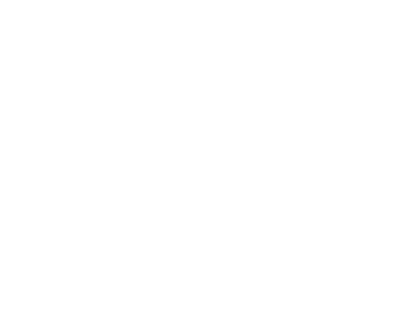

# How to generate synthetic data and train a model with it? 

### Generation of synthetic data for machine learning

 

### Hallison Paz

---

# Generation of synthetic data for machine learning

### 1. ~~Why does synthetic data matter?~~
### 2. **How to generate synthetic data and train a model with it**
### 3. Do they live in a simulation? Training models for dynamic environments

---

<!-- _class: topic -->

# Recap

---
# Last week, we saw ...

* **We need a lot of data** to train machine learning models
* Creating large scale datasets is hard and presents both technical and ethical challenges
* **Synthetic data** can help us overcome these challenges
* But we must pay the cost of the **Reality Gap**
  * Domain randomization
  * Domain adaptation

---

# Today's agenda

* **What tools** can we use to generate synthetic data
* **What strategy** we can use to generate a good dataset
* **How to generate** synthetic data using one of these tools
* **How to train** an object detector model using the generated data

---

<!-- _class: topic -->
# Tools

---
# Tools

* Modeling and media platforms
  * [Blender](https://www.blender.org)
  * [Unreal Engine](https://www.unrealengine.com/en-US/)
  * [Unity](https://unity.com)
  * [Nvidia Omniverse]()
* Inside games
  * GTA V
  * Half-Life 2
* Simulators engines
  * [Mujoco](http://www.mujoco.org)

<!-- direita, imagem de cenário 3d com eixos -->

---

# BlenderProc

- Modular procedural pipeline
- Focus on realism, not speed
<iframe width="560" height="315" src="https://www.youtube.com/embed/tQ59iGVnJWM" title="YouTube video player" frameborder="0" allow="accelerometer; autoplay; clipboard-write; encrypted-media; gyroscope; picture-in-picture" allowfullscreen></iframe>

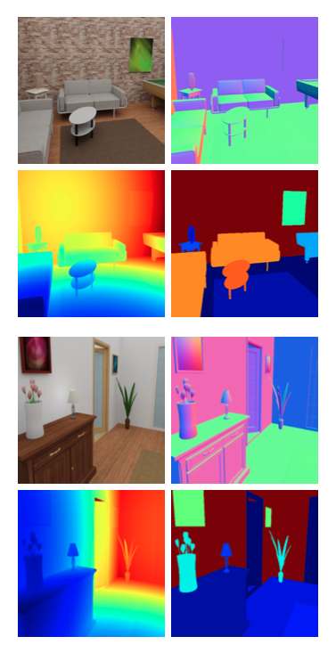

<!--_footer: BlenderProc [on Github](https://github.com/DLR-RM/BlenderProc)-->

---
# Omniverse

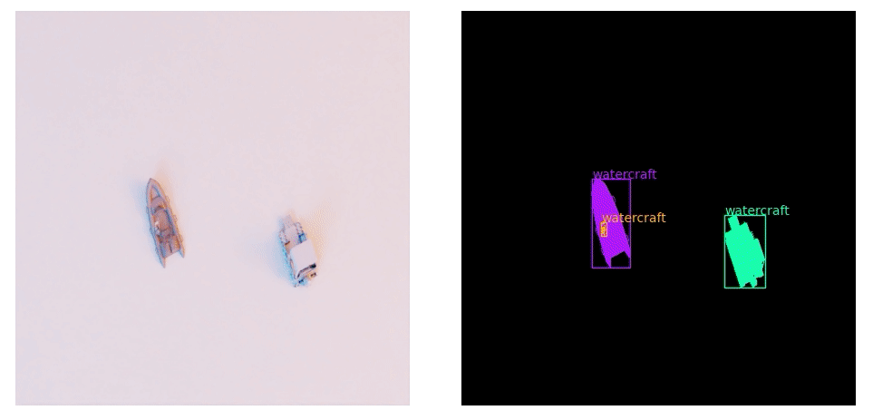

<!-- _footer: Omniverse [Documentation](https://docs.omniverse.nvidia.com/app_isaacsim/app_isaacsim/syntheticdata_samples.html) for the Isaac Sim app-->

---

# Omniverse

- Real-time simulation and colaboration
- Kaolin  

<iframe width="560" height="315" src="https://www.youtube.com/embed/bSJCYZMoHAo" title="YouTube video player" frameborder="0" allow="accelerometer; autoplay; clipboard-write; encrypted-media; gyroscope; picture-in-picture" allowfullscreen></iframe>

<!-- _footer: Kaolin app [user manual](https://docs.omniverse.nvidia.com/app_kaolin/app_kaolin/user_manual.html)-->
---

# Unity

- Perception Package
- Dataset Insights
- Cloud
* Synthdet project and tutorials

https://logicai.io/blog/synthetic-data-deep-learning/

---
<!-- _class: topic -->
<!-- _paginate: false -->
# Strategy

---

# An annotation saved is an annotation earned: Using fully synthetic training for object detection

* Retail objects detection
* Scene **completely synthetic**
* Two layers of objects: background and foreground
* Control over the statistics of the dataset

<!-- _footer: S. Hinterstoisser, O. Pauly, H. Heibel, M. Marek, and M. Bokeloh, “An annotation saved is an annotation earned: Using fully synthetic training for object detection,” in 2019 IEEE/CVF --->

---
# Pipeline

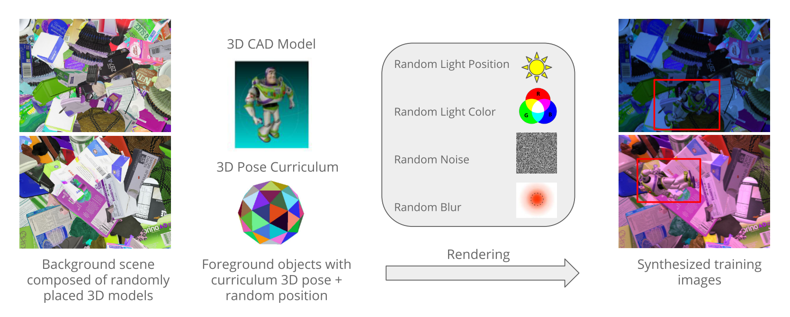

---

# Pose

* generate rotations by recursively dividing an icosahedron,
the largest convex regular polyhedron. This approach yields
uniformly distributed vertices on a sphere
* Fur-thermore, we sample the distance at which we render a fore-ground object inversely proportional to its projected size to
guarantee an approximate linear change in pixel coverage
of the projected object between consecutive scale levels.

---

This means that there is a deterministic schedule
at which step each object and pose should be rendered:

1. We start with the scale that is closest to the camera and gradually move to the one that is farthest away; As a result, each object initially appears largest in the image, being therefore easier to learn for the network. As
2. For each scale, we iterate through all possible out-of-plane rotations, and for each out-of-plane rotation, we iterate through all in-plane rotations.
3. Once we have a scale, an out-of- and an in-plane rota- tion, we iterate through all objects, and render each of them with the given pose at a random location using a uniform distribution.
4. After having processed all objects, at all in- and out-of plane rotations, we move to the next scale level.

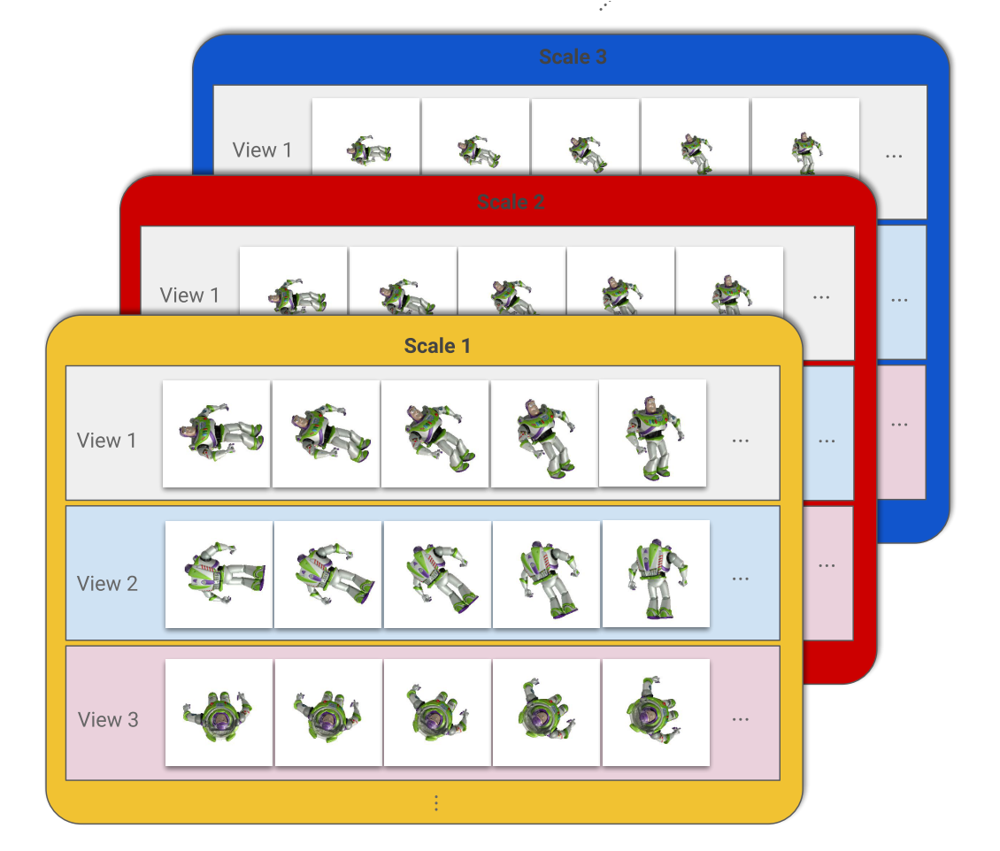

---

For rendering, we allow cropping of foreground objects
at the image boundaries up to 50%.

In addition, we al-low for overlap between each pair of foreground objects
up to 30%.

We also generate an occlusion layer where we allow ran-dom objects from the background dataset to partially oc-clude the foreground objects.

---
# Post processing

Having the background, foreground and occlusion layer,
we fuse all three layers to one combined image: the occlusion layer is rendered on top of the foreground layer and the result is rendered on top of the background layer. Fur- thermore, we add random light sources with random pertur- bations in the light color. 
* Finally, we add white noise and blur the image with a Gaussian kernel where both, 
  * the kernel size and the standard deviation, are randomly selected. 
* **Thus, background, foreground and the occluding parts share the same image properties**.

---

Using this camera, we built a training and
evaluation benchmark of 1158 and 250 real RGB images,
respectively, at a resolution of 960x720.

Our benchmark
training set consists of images picturing random subsets of
the objects of interest disposed on cluttered background and
in different lighting conditions (natural day/evening light
vs. artificial light). The evaluation set consists of images
displaying the objects of interest randomly distributed in
shelves, boxes or layed out over random clutter. Since it
is crucial for reliable object detection, we made sure that
in both sets each object is shown in various poses and ap-pears equally (roughly around 120 times for each object in
the training set and around 40 times in the evaluation set).

All three models have been trained using distributed asyn-chronous stochastic gradient descent with a learning rate
of 0.0001 for 850K iterations.
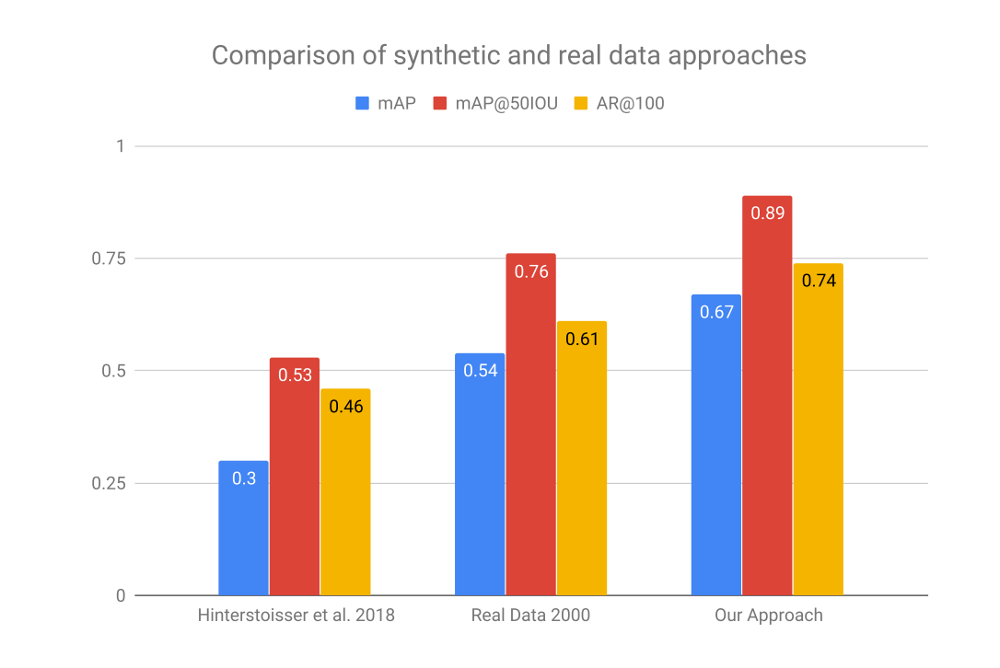

---

we compare 2
Faster R-CNN models initialized with the same weights, the
first being trained using complete random pose sampling,
and the other one following our curriculum strategy.
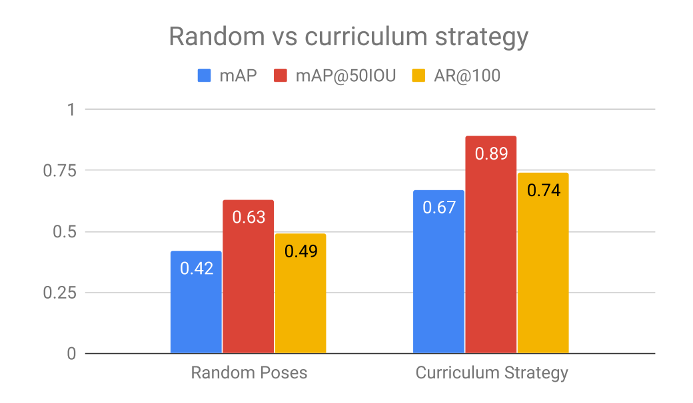

---

* shows that best re-sults can be obtained for a range that yields background ob-jects of similar or larger size than foreground objects.

Using smaller scale ranges yields background images that look
more like textures,

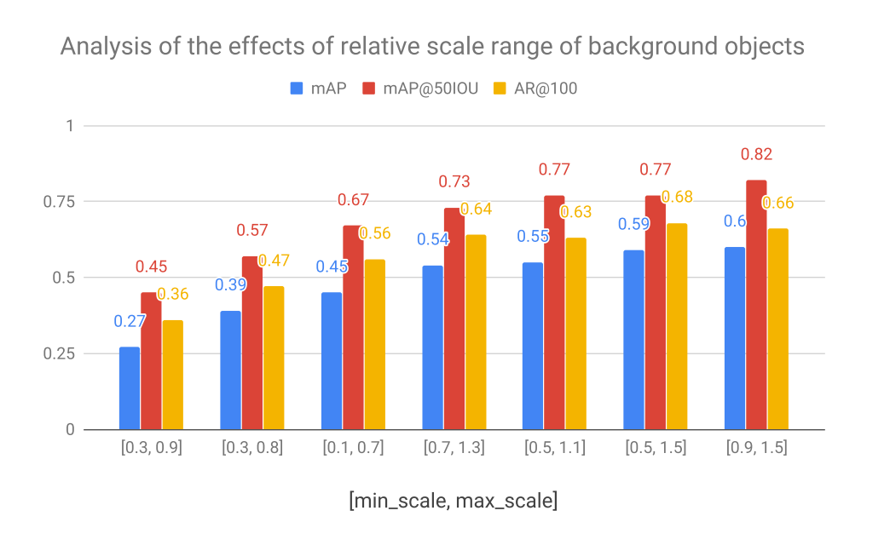

---
 
- dsdsd shows that a higher number of foreground objects
yields better performance
- Please note that we only set an
upper limit to the number of foreground objects drawn in
one image
- In particular, in the early stages of curriculum learn-ing we can only fit 8-9 objects in one image on average.

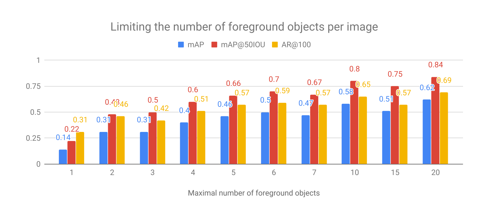

---

# Real vs Synthetic Background

- fully synthetic back- ground coverage outperforms images in which only parts of the image are covered by synthetic objects
- Network can't distinguish based on image nature

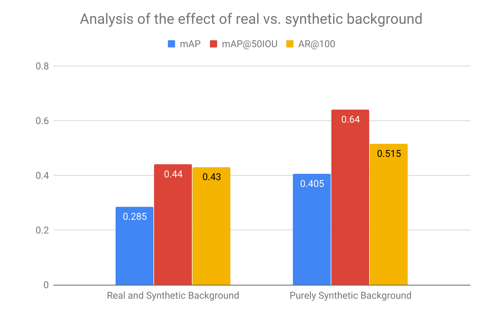

---
# XXX Single influence

- Blurring and random light color are important yet
simple operations to apply to the synthetic images to improve the
results.

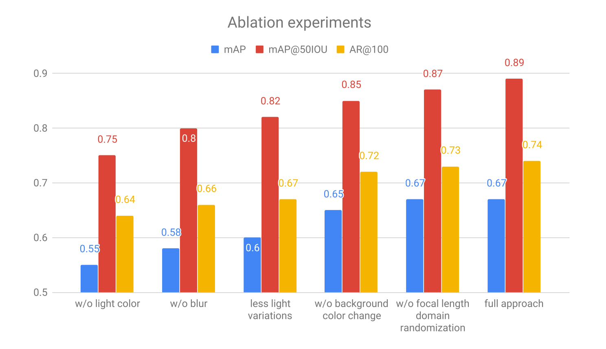

---
# Strategy

For each foreground object, we start by generating a
large set of poses uniformly covering the pose space in which we want to be able to detect the corresponding ob- ject. To do so, we use the approach described in [10] and generate rotations by recursively dividing an icosahedron, the largest convex regular polyhedron. This approach yields uniformly distributed vertices on a sphere and each vertex represents a distinct view of an object defined by two out- of-plane rotations.

---
<!-- _class: topic -->

# How to generate

---

# Synthdet

<iframe width="810" height="456" src="https://www.youtube.com/embed/x7vj-dFWUUY" title="YouTube video player" frameborder="0" allow="accelerometer; autoplay; clipboard-write; encrypted-media; gyroscope; picture-in-picture" allowfullscreen></iframe>

SCHEMA: https://www.nuscenes.org/nuscenes#data-format
https://github.com/Unity-Technologies/com.unity.perception/blob/master/com.unity.perception/Documentation%7E/Schema/Synthetic_Dataset_Schema.md

---

# Results...

---

# How can we do it?

---

# Unity Tutorials

---

# Dataset evaluation

- Python package: Dataset Insights 

---
<!-- _class: topic -->
# Can we do better?

---

Procedural generation?

S. Qi, Y. Zhu, S. Huang, C. Jiang, and S. Zhu. Human-centric indoor scene synthesis using stochastic grammar. In 2018 IEEE/CVF Conference on Computer Vision and Pattern Recognition, pages 5899–5908, June 2018.

---
<!-- _class: topic -->
<!-- _paginate: false -->
# How to train a model

---

# Demo on Pytorch

- It's basically the same as if we were using real data
- Please, check [this notebook on Google Colab](https://colab.research.google.com/github/visgraf/syntheticlearning/blob/main/notebooks/SyntheticDataObjectDetection.ipynb) for an example.

---

# Conclusion

---

# Conclusion

* There tools available 
* A small team can do it

---
<!-- _class: topic -->
<!-- _paginate: false -->

# Wow! What's next?

---

# Next week...

##### Generation of synthetic data for machine learning

 

#### 1. ~~Why does synthetic data matter?~~
#### 2. ~~How to generate synthetic data and train a model with it~~
#### 3. **Do they live in a simulation? Training models for dynamic environments**

---
<!-- paginate: false -->
<!-- _class: invert -->

# THANK YOU!

[hallpaz@impa.br](mailto:hallpaz@impa.br)

