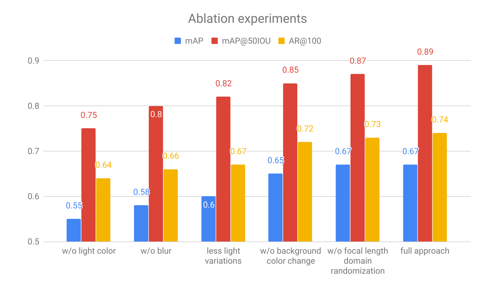

---

marp: true
inlineSVG: true
theme: blue
draft: true
paginate: true

---
<!-- _color: white -->
<!-- _class: invert -->
<!-- _paginate: false -->

# How to generate synthetic data and train a model with it? 

### Generation of synthetic data for machine learning

 

### Hallison Paz

---

# Generation of synthetic data for machine learning

### 1. ~~Why does synthetic data matter?~~
### 2. **How to generate synthetic data and train a model with it**
### 3. Do they live in a simulation? Training models for dynamic environments

---

<!-- _class: topic -->
<!-- _paginate: false -->

# Recap

---
# Last week, we saw ...

* **We need a lot of data** to train machine learning models
* Creating large scale datasets is hard and presents both technical and ethical challenges
* **Synthetic data** can help us overcome these challenges
* But we must pay the cost of the **Reality Gap**
  * Domain randomization
  * Domain adaptation

---

# Today's agenda

* **What tools** can we use to generate synthetic data
* **What strategy** we can use to generate a good dataset
* **How to generate** synthetic data using one of these tools
* **How to train** an object detector model using the generated data

---
<!-- _paginate: false -->
<!-- _class: topic -->
# Tools

---
# Tools

* Modeling and media platforms
  * [Blender](https://www.blender.org)
  * [Unreal Engine](https://www.unrealengine.com/en-US/)
  * [Unity](https://unity.com)
  * [Nvidia Omniverse]()
* Inside games
  * GTA V
  * Half-Life 2
* Simulators engines
  * [Mujoco](http://www.mujoco.org)

<!-- direita, imagem de cenário 3d com eixos -->

---

# Blender

- Uses Python as scripting language

---

# BlenderProc

- Modular procedural pipeline
- Focus on realism, not speed
<iframe width="560" height="315" src="https://www.youtube.com/embed/tQ59iGVnJWM" title="YouTube video player" frameborder="0" allow="accelerometer; autoplay; clipboard-write; encrypted-media; gyroscope; picture-in-picture" allowfullscreen></iframe>

<!--_footer: BlenderProc [on Github](https://github.com/DLR-RM/BlenderProc) | [Examples](https://logicai.io/blog/synthetic-data-deep-learning/) -->

---
# Omniverse

<!-- _footer: Omniverse [Documentation](https://docs.omniverse.nvidia.com/app_isaacsim/app_isaacsim/syntheticdata_samples.html) for the Isaac Sim app-->

---

# Omniverse

- Real-time simulation and colaboration
- Kaolin  

<iframe width="560" height="315" src="https://www.youtube.com/embed/bSJCYZMoHAo" title="YouTube video player" frameborder="0" allow="accelerometer; autoplay; clipboard-write; encrypted-media; gyroscope; picture-in-picture" allowfullscreen></iframe>

<!-- _footer: Kaolin app [user manual](https://docs.omniverse.nvidia.com/app_kaolin/app_kaolin/user_manual.html)-->
---

# Unity

<iframe width="560" height="315" src="https://www.youtube.com/embed/IuFOfWLlwwE" title="YouTube video player" frameborder="0" allow="accelerometer; autoplay; clipboard-write; encrypted-media; gyroscope; picture-in-picture" allowfullscreen></iframe>

<!-- _footer: Page: [Unity Computer Vision](https://unity.com/products/computer-vision) -->
---

# Unity

- Perception Package
- Dataset Insights
- Cloud simulations
* Synthdet project and tutorials

---
<!-- _class: topic -->
<!-- _paginate: false -->
# Strategy

---

# An annotation saved is an annotation earned: Using fully synthetic training for object detection

* Retail objects detection
* Scene **completely synthetic**
* Two layers of objects: background and foreground
* Control over the statistics of the dataset

<!-- _footer: S. Hinterstoisser, O. Pauly, H. Heibel, M. Marek, and M. Bokeloh, “An annotation saved is an annotation earned: Using fully synthetic training for object detection,” in 2019 IEEE/CVF --->

---
# Pipeline

---

# Pose

* Generate rotations by uniformly distributing vertices on a sphere
* Sample the distance of a foreground object inversely proportional to its projected size to guarantee an approximate linear change in pixel coverage

---

# Deterministic schedule for poses

1. Pick a scale: closest to (gradually) farthest
2. Iterate through all possible rotations
3. Then iterate through all objects, and render each of them with the given pose at a random location using a uniform distribution.
4. Finally, move to the next scale level.

---

# Occlusion layer

* Allow for overlap between each pair of foreground objects up to 30%
* Allow random objects from the background dataset to partially occlude the foreground objects
* Allow cropping of foreground objects at the image boundaries up to 50%

---
# Post processing

* Occlusion layer -> foreground layer -> background layer
* Random light sources with random perturbations in the light color
* White noise and blur with a Gaussian kernel
  * Randomly selected kernel size and standard deviation 
* Important: background, foreground and the occluding parts **share the same image properties**.

---

# Evaluation

* "We built a training and evaluation benchmark of 1158 and 250 real RGB images, respectively, at a resolution of 960x720"

* Benchmark training set 
  * Random subsets of the objects of interest 
  * Cluttered background
  * Different lighting conditions 

* Each object is shown in various poses and appears equally

* All three models have been trained using distributed asynchronous stochastic gradient descent with a learning rate of 0.0001 for 850K iterations.

<!-- _footer: S. Hinterstoisser, O. Pauly, H. Heibel, M. Marek, and M. Bokeloh, “An annotation saved is an annotation earned: Using fully synthetic training for object detection,” in 2019 IEEE/CVF --->

---
## Synthetic vs Real

---
## Random vs Curriculum strategy

* Faster R-CNN models initialized with the same weights

---

## Relative size of background objects

* Best results with similar or larger size than foreground objects.
  * Smaller scale ranges may look like textures

---
 
## Higher number of foreground objects -> better
###### *"note that we only set an upper limit to the number of foreground objects drawn in one image"*

---

## Real vs Synthetic Background

- Fully synthetic background yelds better performance
- Network can't distinguish based on image nature

---
## Other parameters

---
<!-- _class: topic -->

# How to generate the synthetic dataset

---

# Synthdet

<iframe width="810" height="456" src="https://www.youtube.com/embed/x7vj-dFWUUY" title="YouTube video player" frameborder="0" allow="accelerometer; autoplay; clipboard-write; encrypted-media; gyroscope; picture-in-picture" allowfullscreen></iframe>

SCHEMA: https://www.nuscenes.org/nuscenes#data-format
https://github.com/Unity-Technologies/com.unity.perception/blob/master/com.unity.perception/Documentation%7E/Schema/Synthetic_Dataset_Schema.md

---

# Unity Tutorials

* Synthdet [project](https://github.com/Unity-Technologies/SynthDet)
* Unity [Perception package](https://github.com/Unity-Technologies/com.unity.perception)

---
# Synthdet workflow

<!-- _footer: from Synthdet tutorial -->

---

# Dataset evaluation

- Python package: Dataset Insights 

---
<!-- _class: topic -->
# Can we do better?

---

Procedural generation?

S. Qi, Y. Zhu, S. Huang, C. Jiang, and S. Zhu. Human-centric indoor scene synthesis using stochastic grammar. In 2018 IEEE/CVF Conference on Computer Vision and Pattern Recognition, pages 5899–5908, June 2018.

---
<!-- _class: topic -->
<!-- _paginate: false -->
# How to train a model

---

# Demo on Pytorch

- It's basically the same as if we were using real data
- Please, check [this notebook on Google Colab](https://colab.research.google.com/github/visgraf/syntheticlearning/blob/main/notebooks/SyntheticDataObjectDetection.ipynb) for an example.

---
<!-- _class: topic -->
<!-- _paginate: false -->
# Conclusion

---

# Conclusion

* There are many tools available to generate synthtetic datasets
* It's important to have a strategy to generate good data
  * We can iterate dataset versions
* Even a small team can generate large scale synthetic datasets
  * There are already tutorials to help with this task

---
<!-- _class: topic -->
<!-- _paginate: false -->

# Wow! What's next?

---

# Next week...

##### Generation of synthetic data for machine learning

 

#### 1. ~~Why does synthetic data matter?~~
#### 2. ~~How to generate synthetic data and train a model with it~~
#### 3. **Do they live in a simulation? Training models for dynamic environments**

---
<!-- paginate: false -->
<!-- _class: invert -->

# THANK YOU!

[hallpaz@impa.br](mailto:hallpaz@impa.br)

---

# References

1. S. Hinterstoisser, O. Pauly, H. Heibel, M. Marek, and M. Bokeloh, “An annotation saved is an annotation earned: Using fully synthetic training for object detection,” in 2019 IEEE/CVF
2. 

