---

marp: true
inlineSVG: true
theme: blue
draft: true
paginate: true

---
<!-- _color: white -->
<!-- _class: invert -->
<!-- _paginate: false -->

# Do they live in a simulation? Training models for dynamic environment 

### Generation of synthetic data for machine learning

 

### Hallison Paz

---

# Generation of synthetic data for machine learning

### 1. ~~Why does synthetic data matter?~~
### 2. ~~How to generate synthetic data and train a model with it~~
### 3. **Do they live in a simulation? Training models for dynamic environments**

---

<!-- _class: topic -->
<!-- _paginate: false -->

# Recap

---
# Two weeks ago ...

* **We need a lot of data** to train machine learning models
* Creating large scale **datasets** is hard and presents both **technical and ethical challenges**
* **Synthetic data** can help us overcome these challenges
* But we must pay the cost of the **Reality Gap**
  * Domain randomization
  * Domain adaptation

---

# Last week ...

* There are many **tools** available to generate synthetic datasets
* It's important to have a **strategy** to generate good data
  * We can iterate dataset versions
* Even a small team can generate **large scale** synthetic datasets
  * There are already tutorials to help with this task

---

# Today's agenda

* Why simulations?
* Techniques to train models for dynamic environments
* Challenges of simulations for machine learning
* Tools to generate simulations and capture data

---
<!-- _class: topic -->
<!-- _paginate: false -->

# Why Simulations?

---

# Train agents for dynamic and complex environments

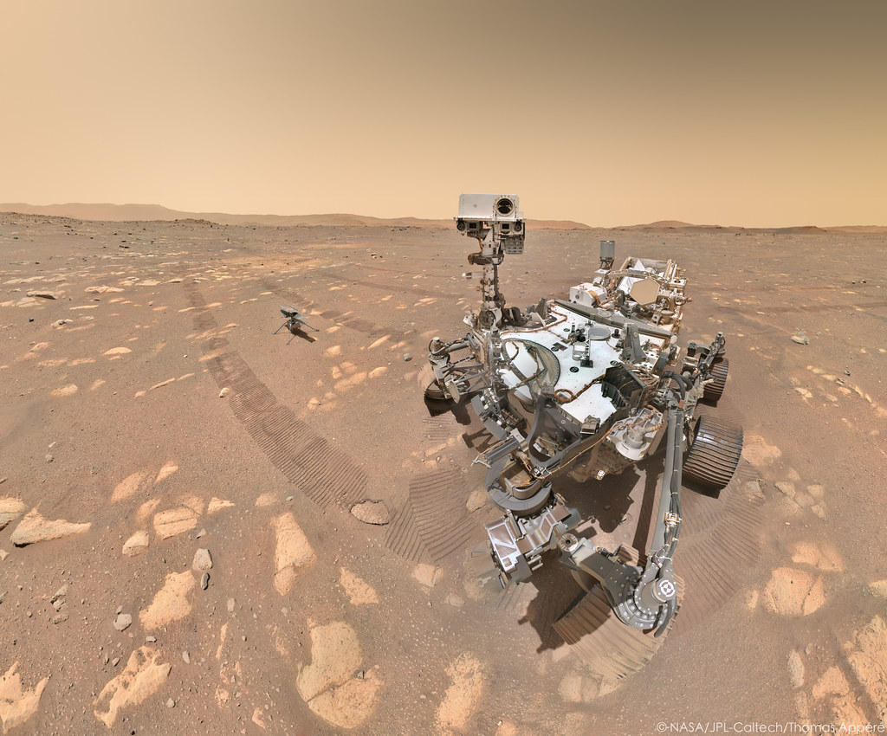

---
# Tasks | Self-driving cars

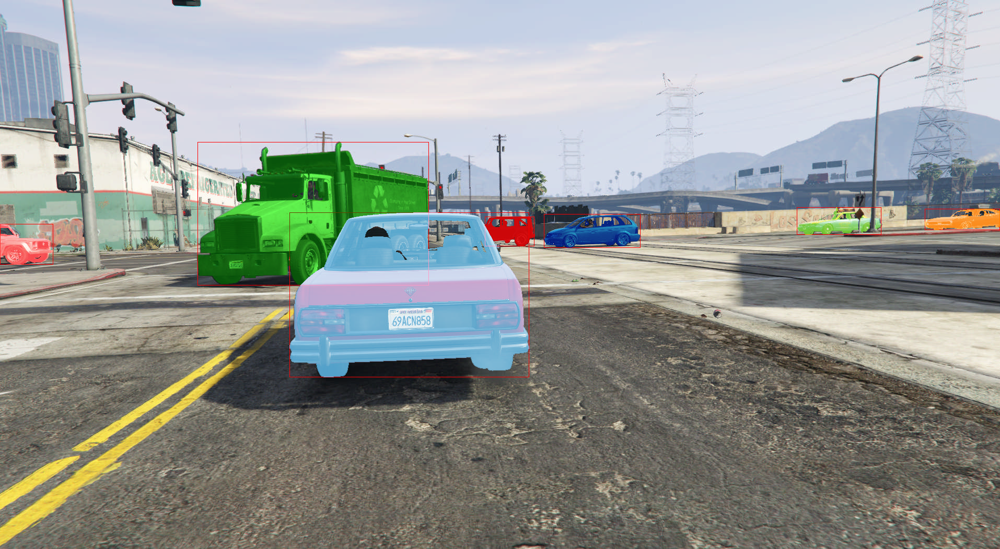
<!-- _footer: Johnson-Roberson et al, 2017 -->
---
# Tasks | Unmanned Aircraft Systems

- Aerial photography 
- Search and rescue 
- Package delivery...

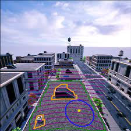

<!-- _footer: Jeremy Castagno, Yu Yao and Ella Atkins. Realtime Rooftop Landing Site Identification and Selection in Urban City Simulation. 2019 -->
---

# Tasks | Human like manipulation

<iframe width="560" height="315" src="https://www.youtube.com/embed/jwSbzNHGflM?start=22" title="YouTube video player" frameborder="0" allow="accelerometer; autoplay; clipboard-write; encrypted-media; gyroscope; picture-in-picture" allowfullscreen></iframe>

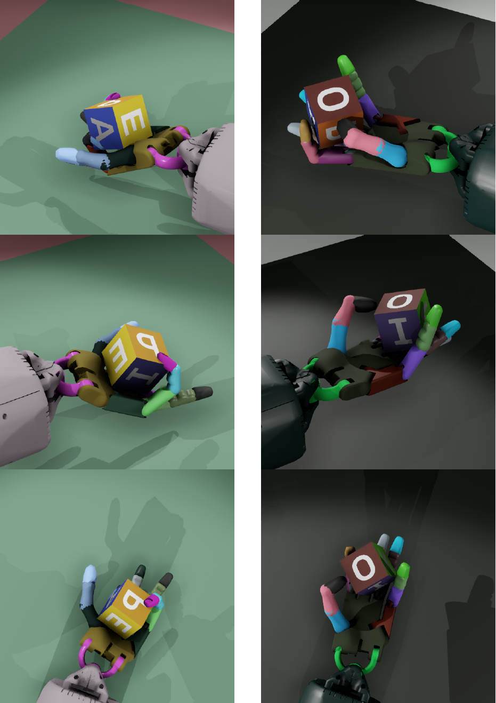

<!-- _footer: OpenAI [Learning Dexterity](https://openai.com/blog/learning-dexterity/)-->

---

# Tasks | Perform alongside humans

###### BMW Factory Digital Twin

<iframe width="560" height="315" src="https://www.youtube.com/embed/6-DaWgg4zF8" title="YouTube video player" frameborder="0" allow="accelerometer; autoplay; clipboard-write; encrypted-media; gyroscope; picture-in-picture" allowfullscreen></iframe>

---

# Behavior | Digital Humans

- How to train an agent to interact with humans?
  * Simulating humans
 

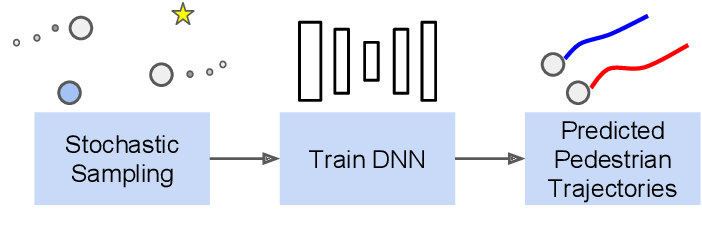

<!-- _footer: Anderson, C.; Du, X.; Vasudevan R.; & Johnson-Roberson, M. Stochastic Sampling Simulation for Pedestrian Trajectory Prediction. In 2019 IEEE/RSJ. -->

---
# Behavior | Crowds

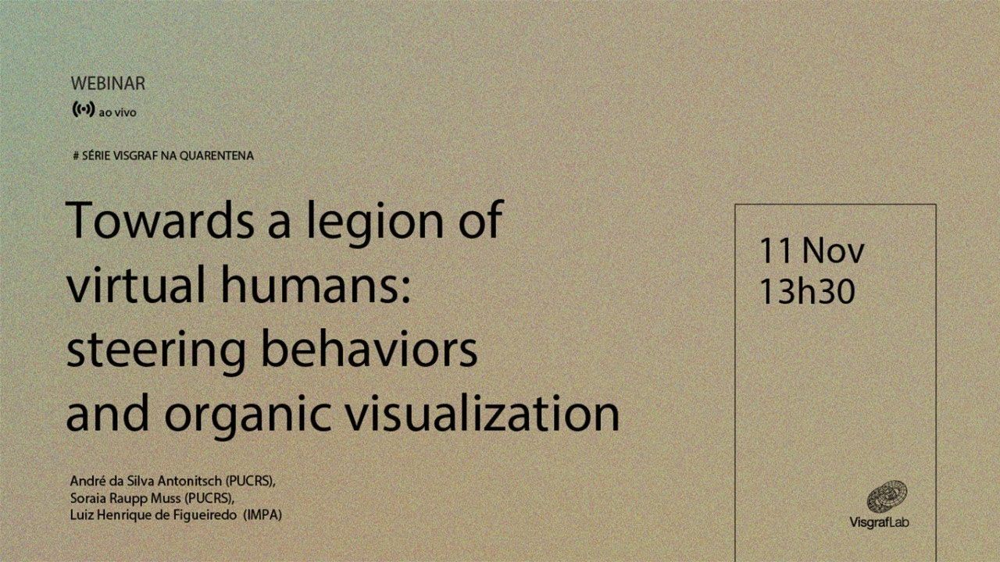

<!--_footer: A. Antonitsch, S. Musse, & L. Figueiredo (2020). [Towards a Legion of Virtual Humans](https://youtu.be/EK1JUbUrSKs): Steering Behaviors and Organic Visualization. 2020 33rd SIBGRAPI. -->

---
# Behavior | Crowds

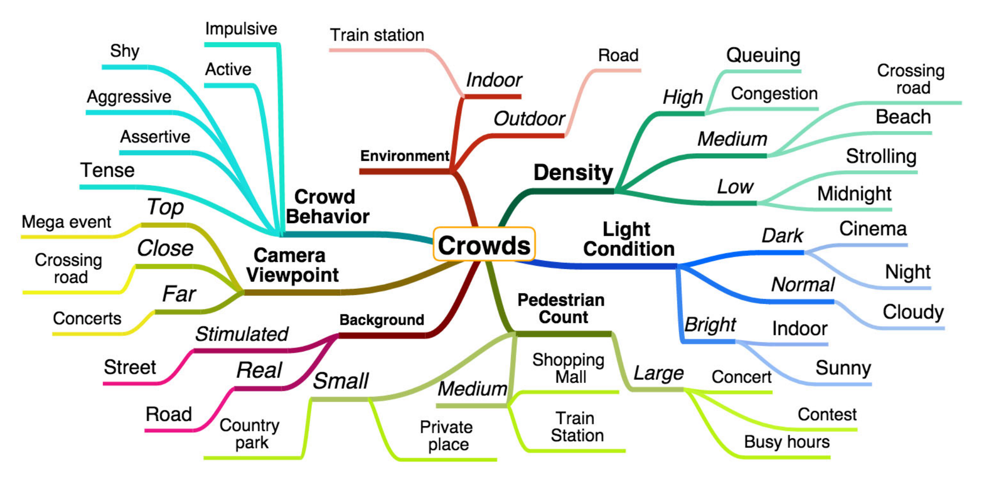

<!-- _footer: Ernest Cheung, Tsan Kwong Wong, Aniket Bera, Xiaogang Wang & Dinesh Manocha. [LCrowdV: Generating Labeled Videos for Simulation-based Crowd Behavior](http://gamma.cs.unc.edu/LCrowdV/). ECCVW 2016 -->

---
# Computer Graphics | Stunts

<iframe width="560" height="315" src="https://www.youtube.com/embed/SIB760LoAGM" title="YouTube video player" frameborder="0" allow="accelerometer; autoplay; clipboard-write; encrypted-media; gyroscope; picture-in-picture" allowfullscreen></iframe>

<!-- _footer: DeepMotion: Physically Simulated AI Agents | Can They Replace Stuntmen? -->

---
# Computer Graphics | Animation

<!--_footer: [Deep Dribble](https://blog.deepmotion.com/2018/08/07/deepdribble-simulating-basketball-with-ai/): Simulating Basketball with AI-->

---

# New possibilities | Digital Humans...or dogs

###### What if we perform tasks in the virtual world?
<iframe width="560" height="315" src="https://www.youtube.com/embed/FhXLi7NmbCk?start=2995" title="YouTube video player" frameborder="0" allow="accelerometer; autoplay; clipboard-write; encrypted-media; gyroscope; picture-in-picture" allowfullscreen></iframe>

---
# Why learn on simulations

### We want to...

- Train intelligent agents to perform task in the real world
- Simulate behaviors according to the real world

---

# Why learn on simulations

### We also want to...

* Get accurate and better results
  * More data; dataset diversity...
* Have a cheaper and easier process
  * Automatic annotations
* Train Faster
  * "Time is an illusion": we can go faster than real-time
* Train Safer
  * Some scenarios are dangerous to experiment in real life 

---
<!-- _class: topic -->
<!-- _paginate: false -->
# Techniques

---
# Reinforcement Learning

A model for the ideia of trial and error to train agents to make decisions in complex environments

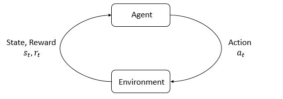

---
# Reinforcement Learning

- Markov Decision Process (MDP), 5-tuple, $\langle S, A, R, P, \rho_0 \rangle$, where
  - S is the set of all valid **states**
  - A is the set of all valid **actions**
  - $R : S \times A \times S \to \mathbb{R}$ is the **reward function**, with $r_t = R(s_t, a_t, s_{t+1})$
  - $P : S \times A \to \mathcal{P}(S)$ is the **transition probability function**, with $P(s'|s,a)$ being the probability of transitioning into state $s'$ if you start in state $s$ and take action $a$
  - $\rho_0$ is the starting state distribution.

---
# Reinforcement Learning

- **Policy**: rule used to decide what actions to take
  - Deterministic: $a_t =\mu_{\theta}(s_t)$
  - Stochastic: $a_t \sim \pi_{\theta}(\cdot | s_t)$

* Deep Reinforcement Learning: $\theta$ parameters of the network
* **Trajectory**: sequence of states and actions
  * $\tau = (s_0, a_0, s_1, a_1, ...)$

---
# Reinforcement Learning
- Reward or return
$$r_t = R(s_t, a_t, s_{t+1})$$

- Cumulative reward over a trajectory

$$R(\tau) = \sum_{t=0}^{\infty} \gamma^t r_t$$ 
or
 $$R(\tau) = \sum_{t=0}^T r_t$$

---

# Reinforcement Learning

- The goal in RL is to **select a policy $\pi$ which maximizes expected return**

$$\pi^* = \arg \max_{\pi} J(\pi)$$

$$J(\pi) = \int_{\tau} P(\tau|\pi) R(\tau) = \underset{\tau\sim \pi}{E}{R(\tau)}$$

$$P(\tau|\pi) = \rho_0 (s_0) \prod_{t=0}^{T-1} P(s_{t+1} | s_t, a_t) \pi(a_t | s_t)$$

---

# Reinforcement Learning

<video autoplay="" src="https://d4mucfpksywv.cloudfront.net/openai-baselines-ppo/knocked-over-stand-up.mp4" loop="" controls="" style="display: block; margin-left: auto; margin-right: auto; margin-bottom:1.5em; width: 100%; max-width: 720px; max-height: 80vh;">
</video>

---

# Imitation Learning

#### IDEA: learn from an expert demonstration, rather than a carefully designed reward function.

* Provides prior knowledgde to the system, rather than trial and error.

<!-- _footer: Robert Dadashi, Léonard Hussenot, Matthieu Geist, & Olivier Pietquin. [Primal Wasserstein Imitation Learning](https://ai.googleblog.com/2020/09/imitation-learning-in-low-data-regime.html). ICLR, 2021. -->
---
# Imitation Learning

- Behavioral Cloning
  * Directly replicating desired behaviour
* Inverse Reinforcement Learning / Inverse Optimal Control
  * Learning the hidden objectives of the desired behavior

---
<!-- _class: topic -->
<!-- _paginate: false -->
# Challenges

---

# Challenges

- We know the goal, we know some methods, but...
* We still need to deal with the **Reality Gap**
  * Now it's a dynamic environment (more parameters)
  * We have physical constraints
* Agents usually must **act in the real world**
  * Sometimes models learn to "cheat" the simulator
* **How to reduce the effort to generate coeherent simulations?**

---
# Challenges

- Domain randomization might require carefull and task-specific selection of parameters

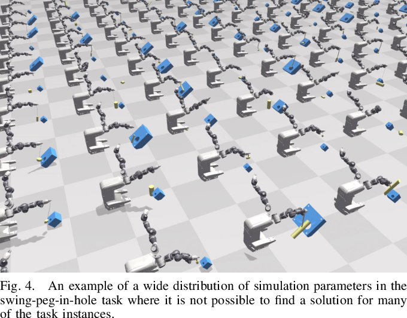

<!-- _footer: Chebotar, Y.; Handa, A.; Makoviychuk, V.; Macklin, M.; Issac, J.; Ratliff, N.; & Fox, D. [Closing the Sim-to-Real Loop](https://arxiv.org/abs/1810.05687): Adapting Simulation Randomization with Real World Experience". ICRA, 2019. -->

---
# Closing the Sim-to-Real Loop

- Overly wide distribution might be disadvantageous
  * Unrealistic scenarios
  * Stress over physical components
* Randomization might be biased by the expertise of the practitioner

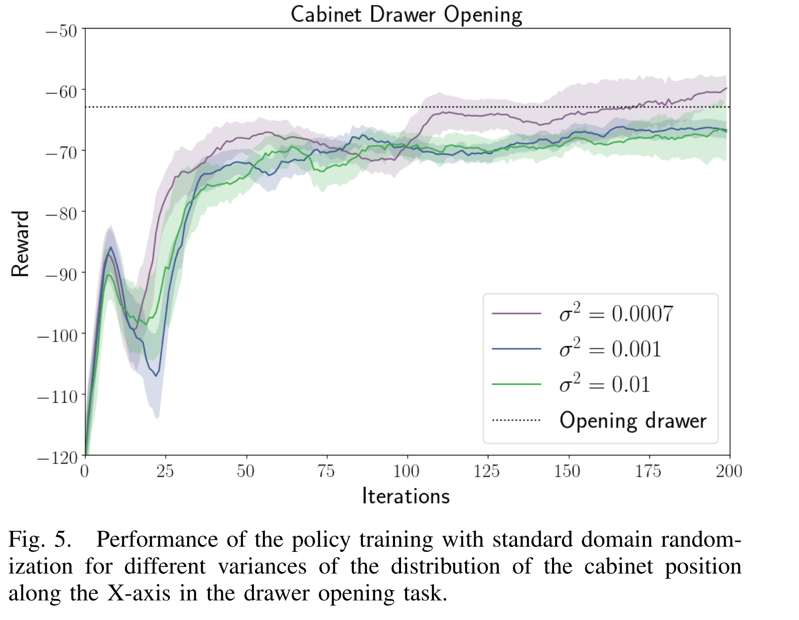

<!-- _footer: Chebotar, Y.; Handa, A.; Makoviychuk, V.; Macklin, M.; Issac, J.; Ratliff, N.; & Fox, D. [Closing the Sim-to-Real Loop](https://arxiv.org/abs/1810.05687): Adapting Simulation Randomization with Real World Experience". ICRA, 2019. -->

---

# Closing the Sim-to-Real Loop

- Start with some initial distribution of the simulation parameters
* Learn in simulation
* Use real world roll-outs of learned policies to gradually change the simulation randomization 

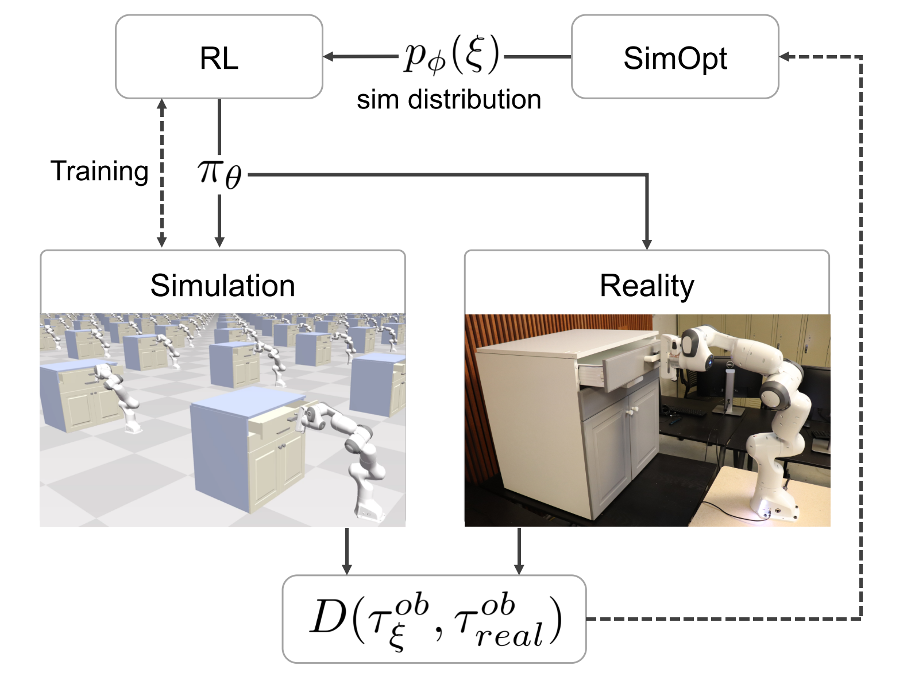

---
# Challenges

- **Domain adaptation** might be useful for general tasks

<!-- Simulating many years of robotic interaction is quite feasible with modern parallel computing, physics simulation, and rendering technology. Moreover, the resulting data comes with automatically-generated annotations, which is particularly important for tasks where success is hard to infer automatically. The challenge with simulated training is that even the best available simulators do not perfectly capture reality. Models trained purely on synthetic data fail to generalize to the real world, as there is a discrepancy between simulated and real environments, in terms of both visual and physical properties. In fact, the more we increase the fidelity of our simulations, the more effort we have to expend in order to build them, both in terms of implementing complex physical phenomena and in terms of creating the content (e.g., objects, backgrounds) to populate these simulations. This difficulty is compounded by the fact that powerful optimization methods based on deep learning are exceptionally proficient at exploiting simulator flaws: the more powerful the machine learning algorithm, the more likely it is to discover how to "cheat" the simulator to succeed in ways that are infeasible in the real world. The question then becomes: how can a robot utilize simulation to enable it to perform useful tasks in the real world -->

---
# Grasp GAN

- Pixel-level domain adaptation
- Pseudo-real images correct some sim-to-real gap
- However, multi-pixel features or structures may be arbitrarily modified or removed

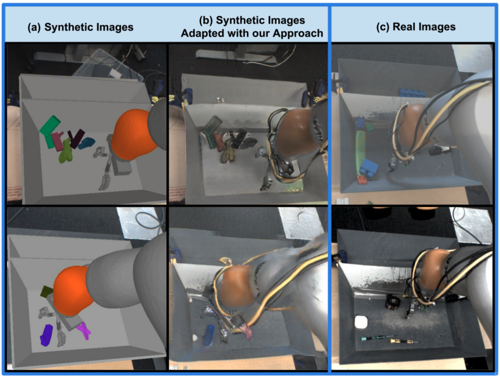

<!-- _footer: Konstantinos Bousmalis, Alex Irpan, Paul Wohlhart, Yunfei Bai, Matthew Kelcey, Mrinal Kalakrishnan, Laura Downs, Julian Ibarz, Peter Pastor Sampedro, Kurt Konolige, Sergey Levine, & Vincent Vanhoucke (2018). Using Simulation and Domain Adaptation to Improve Efficiency of Deep Robotic Grasping. -->

---

# Retina GAN

- Retina-GAN involves a CycleGAN 
- Strong object semantic awareness through an object detection consistency loss 
- Tests object detection feature understanding for robotics applications

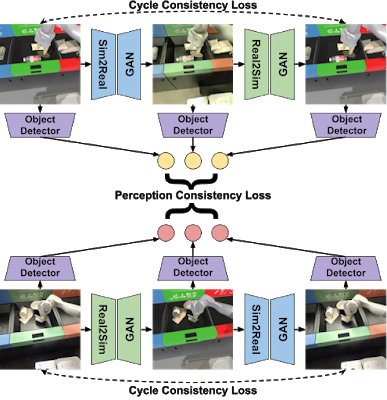

<!-- _footer: Daniel Ho, Kanishka Rao, Zhuo Xu, Eric Jang, Mohi Khansari, & Yunfei Bai. (2020). RetinaGAN: An Object-aware Approach to Sim-to-Real Transfer. -->

---

# Retina GAN

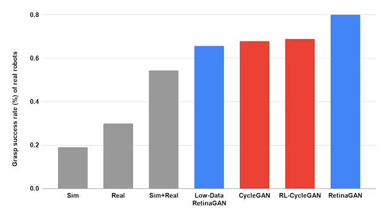

---

# Retina GAN

- Different task and method
- Training on data from three separate RetinaGAN models
  - different random seeds and consistency loss weights

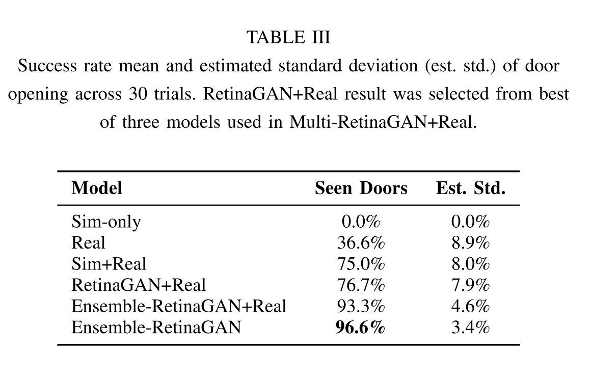

---
<!-- _class: topic -->
<!-- _paginate: false -->

# Tools

---
# Tools

- [Gazebo](http://gazebosim.org)
- [CARLA](https://carla.org/)
- [PyBullet](https://docs.google.com/document/d/10sXEhzFRSnvFcl3XxNGhnD4N2SedqwdAvK3dsihxVUA/edit#heading=h.2ye70wns7io3)
- Nvidia [Isaac Sim](https://developer.nvidia.com/isaac-sim)
- Unity [ML Agents](https://unity.com/pt/products/machine-learning-agents)
* OpenAI [Spinning Up](https://spinningup.openai.com/en/latest/user/introduction.html)

---
<!-- _class: topic -->
<!-- _paginate: false -->

# Conclusion

---
# Conclusion 

- Simulations are important resources for training intelligent agents
- Reinforcement Learning is a powerful technique for this task
- Dynamic environments present new possibilities, but also new challenges
- Simulation platforms keep evolving to support this paradigm - even adding differentiability!

---

<!-- _class: topic -->
<!-- _paginate: false -->

# Wow! What's next?

---

# We made it!
##### Generation of synthetic data for machine learning

 

#### 1. ~~Why does synthetic data matter?~~
#### 2. ~~How to generate synthetic data and train a model with it~~
#### 3. ~~Do they live in a simulation? Training models for dynamic environments~~

---
<!-- _paginate: false -->
<!-- _class: invert -->

# THANK YOU!

[hallpaz@impa.br](mailto:hallpaz@impa.br)
